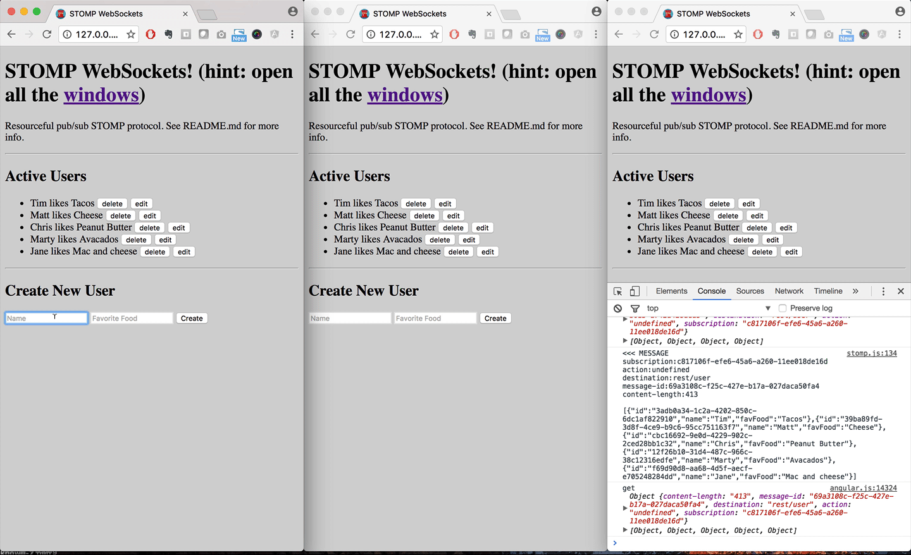

# STOMP WebSockets Dev Spike



## How to run 

- `npm install`
- Make sure gulp and glup-gli are installed globally `npm install -g gulp gulp-cli`
- `gulp serve`
- `node server.js`
- Visit `http://127:0.0.1:3000`.

You can configure the socket url in `src/app/hello.js`.

## Background

This project is the result of a development spike looking at how to connect an AngularJS front-end application with a Spring Java server application.  

Basic workflow to support:

- On initial webapp load, make a bunch of requests to get all existing resources (ex get all users, get all sessions, get all entities).
- Subscribe to updates for each resource (create, update, delete).
- Maintain state between server and client. 

Basic design goals: 

- Avoid reinventing the wheel.
- How do other folks connect Spring server and JS client via WebSockets?
- How messages should be structured? For example, I’m very familiar with the SailsJS socket pattern which emulates rest endpoints in something called Resourceful Pub/Sub. Internally they call this pattern HTTP sim or "virtual request interpretation" (VRI for short).
- If “rooms” and “Channels” are supported (similar to socket.io and other javascript implementations)?
- If it makes sense to use https://github.com/beevelop/ng-stomp.
- How I might setup a simple NodeJS server to simulate the Spring stomp interface? 
- Use Angular to get access to our wealth of components already developed.

## Assumptions 

There are likely more, but the biggest initial assumption is: 

- The client can implement a RESTful pattern, updating entities and their properties, and the server is responsible for logic based on entity changes. 

For example lets say that when a user's name changes the server sends out a welcome email. In this case, the client would simply send the update and the server would do the rest. 

```js 
socket.send('/rest/user/1', {name: 'newName'});
```  

The opposite pattern is that the client needs to send out 2 messages: 

```js 
socket.send('/rest/user/1', {name: 'newName'});
// vs.
socket.send('/actions/welcomeUser', {id: 1});
// or 
socket.send('/rest/user/1/welcome', {id: 1});
```  

The second pattern should be avoided when possible because it adds significant complexity to the client app and sprinkles domain logic between client and server.

## Findings

### Socket.io vs. STOMP 

Officially from their docs: [STOMP](https://stomp.github.io/stomp-specification-1.2.html#Overview) is a simple interoperable protocol designed for asynchronous message passing between clients via mediating servers. [Socket.IO](http://socket.io/) enables real-time bidirectional event-based communication.
 
Socket.io gained a lot of traction in the early days of node because it made real-time apps easy to build. Its super simple to add to your server and client and get something working (ie Hackathons). Nowadays it's development seems lagging - the docs and examples are broken - and there are a few other Socket libraries which have gained traction. 

Much of what Socket.io provides is backwards compatibility with old browsers that don't support Native WebSockets. The other big feature is the concept of rooms and channels. You can subscribe to a room and only get messages sent to that room. The last killer feature is broadcast, the ability for a Socket server to send a message to all clients at once. Socket requires both a Server and Client library to work properly. 

STOMP on the other hand is a specification which can be implemented using different real-time transport methods, like WebSockets, ActiveMQ, etc. Typically you'd use a library that implements STOMP for you, for example [StompJS](https://github.com/jmesnil/stomp-websocket) for Javascript. At a high level, you connect, subscribe, and send messages. There is no channel, room, or broadcast - so the client and server must implement this on their own. 

At a high level STOMP messages have `destination, body, headers`. Example: 

```js 
stomp.client.subscribe('weather', message => {
  console.log(message.headers, message.body);
});
stomp.client.send('weather');
```

At a high level Socket messages have a `event type, body`. Example

```js 
socket.client.on('weather', data => {
  console.log(data);
});
socket.client.emit('weather');
```

### Tech Stack 

After trying a few different options, I decided on this Stack. Note this is basically what Spring recommends using. 

- Native WebSockets 
- StompJS - not under active development, but still the go-to standard (used by Spring).
- AngularJS 1.5.x - Until 2.0 is more widely adopted and our internal tooling is moved over.

Trying it out 

- Mobx - On the client we need to maintain application state. In Angular, this is typically done with a service, adding to rootScope, or with a library like JSData. Modx serves this purpose for us, with the added benefit of Immutability = less scope digest cycles = better performance! If this ultimately doesn't work out it's low effort to swap in an alternative. 

On deck 

- SockJS - A more robust implementation of WebSockets. We'll likely need this soon (also used by Spring). 

For development only 

- [WebStomp](https://github.com/aj0strow/webstomp) Turns out one of the most difficult things about STOMP is implementing a broker/ server. I've used WebStomp to prototype a server for development.  

Considered but not chosen

- React / Redux / etc. - The devs here are doing amazing things, and there is no doubt some new amazing way to maintain state between server and client, but ultimately I wanted to stick with frameworks that we have domain expertise in. 
- JSData / JSData Angular / JSData HTTP - I've used these in the past, but they seemed overkill here because we are not using REST at all and there is really no data modeling we need to support. Seems like Mobx will be a better fit.

### WebSocket message structure 

Even with STOMP we need to decide on a data structure and routing pattern. There are a few obvious approaches here, four of them are outlined below:  

#### Custom baked 

The client and server agree on a set of destinations / event names and a payload for each. On CRUD events the client must manipulate the state, adding or removing the proper entities.  

```js
stomp.subscribe('GET_ALL_USERS', users => {
  this.users.replaceAll(users);
});
stomp.subscribe('ON_USER_CREATED', user => {
  this.users.add(user);
});
stomp.subscribe('ON_USER_DELETED', id => {
  this.users.remove(id);
});
stomp.send('GET_ALL_USERS');
stomp.send('USER_ADD', {name: 'Matt'});
stomp.send('USER_DELETE', 1);
```

#### SailsJS Style / Resourceful Pub/Sub 

The destinations resemble REST endpoints. Server listens for subscriptions for each resource. Actions are sent from the client to the server via 3 well defined destinations (create, update, delete) while the message headers contain the resource URL. For example a message sent to `delete` with the headers `{url: '/rest/user/1'}` would tell the server to delete user 1. The advantage is the server does not need complex router configuration for example `/rest/user/:id` or `/rest/:resourceName/:resourceId`.

Client subscribes and manages state based on actions. [here is a good example](https://github.com/sgress454/sailsChat/blob/master/assets/js/app.js#L36-L78). 

```js 
stomp.subscribe('/rest/user', users => {
  this.users.replaceAll(users);
});
stomp.subscribe('user', data => {
  switch(data.action) {
    case: 'created'; // add
      this.users.add(data.user);
      break;
    case: 'deleted'; // delete 
      this.users.remove(data.id);
      break;
    case: 'updated'; 
      // update 
      break; 
  }
});
stomp.send('/rest/user');
stomp.send('create', {url: '/rest/user', data: {name: 'Matt', favFood: 'tacos'}}); 
stomp.send('update', {url: '/rest/user/1', data: {name: 'Matt', favFood: 'beets'}}); 
stomp.send('delete', {url: '/rest/user/1', data: {id: 1}});
```

#### Resourceful Pub/Sub with simplified state management 

Similar to the previous, with one key difference - the client does not worry about adding, removing, etc. users. Every time the state changes the entire state is sent over STOMP and the client replaces everything. [Here is an example](https://github.com/tjwebb/sails-todomvc/blob/master/assets/js/todomvc.js#L39-L52). Only 1 subscribe is needed per resource type. The example included in src/app is a working example of this. 

```js 
stomp.subscribe('/rest/user', users => {
  this.users.replaceAll(users);
});
stomp.send('/rest/user');
// note this is pseudo code, really we use 2 separate objects for header vs. body.
// In all three instances server sends '/rest/user' message with all users
stomp.send('create', {url: '/rest/user', data: {name: 'Matt', favFood: 'tacos'}}); 
stomp.send('update', {url: '/rest/user/1', data: {name: 'Matt', favFood: 'beets'}});
stomp.send('delete', {url: '/rest/user/1', data: {id: 1}}); 
```

#### Detailed routing 

Like the previous pattern, except the destination url maps to the resource url, instead of simple create, update, or delete. The url is no longer needed in the header. 

```js
stomp.subscribe('/rest/user', users => {
  this.users.replaceAll(users);
});
// note this is pseudo code, really we use 2 separate objects for header vs. body.
// In all three instances server sends '/rest/user' message with all users
stomp.send('/rest/user');
stomp.send('/rest/user', {data: {name: 'Matt', favFood: 'tacos'}}); 
stomp.send('/rest/user/1', {data: {name: 'Matt', favFood: 'beets'}});  
stomp.send('/rest/user/1', {data: {id: 1}}); 
```

#### State only ? 

An interesting approach to consider would be if the client only sent state, and received state. This is not really practical though and would place a burden on the server to detect changes in state.  

```js
stomp.subscribe('userState', users => {
  this.users.replaceAll(users);
});
stomp.send('userState', {data: this.users); 
```

### Rooms and channels 

It's up to the server to support this if needed. Its really as simple as maintaining a hash of connected clients and their subscriptions. [See this issue on GitHub](https://github.com/aj0strow/webstomp/issues/1). 

## Questions 

A few questions still linger which need to be answered by a Spring specialist 


- What is the easiest to integrate from a destination standpoint on the Spring side? For example does Spring work better with destinations that map to resources `/rest/user/1` or would be simple to map to `create, update, delete`. 
